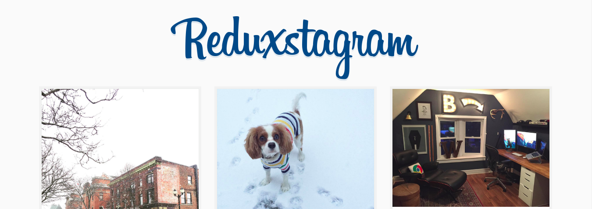

# Reduxstagram

Instagram client made with React & Redux

> [Redux course](https://www.youtube.com/watch?v=hmwBow1PUuo&list=PLu8EoSxDXHP5uyzEWxdlr9WQTJJIzr6jy) from [@wesbos](https://github.com/wesbos)

## Get Started

`npm install`  
_Install all the necessary dependencies_

`npm start`  
_Open <localhost:7770> in your browser_

## Production Build

Run `npm run build` to create a distro folder and a bundle.js file.